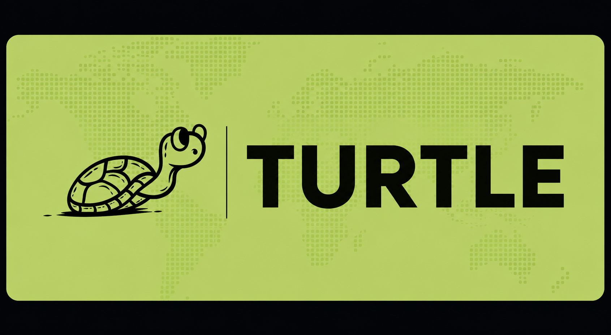

>[!NOTE]
> This is an MVP built in 48 hours at HackByte 4.0, IIITDM Jabalpur. This repository preserves the original hackathon submission as-is. It is archived for reference and is no longer under active development.

  

A natural language interface for orchestrating multiple computers through a single workspace.

---

# What?

Turtle explores a different way of interacting with multiple computers.

Instead of manually connecting to each machine, opening terminals, and repeating the same workflow over and over, you describe what you want in plain English. Turtle understands the request, divides it into smaller tasks, distributes the work to connected machines, and keeps everything synchronized from one interface.

The project was built around a simple idea: controlling an entire fleet of computers should feel no more complicated than giving instructions to a single one. Whether tasks are short-lived or long-running, the focus remains on making execution visible, organized, and easy to follow.

Rather than presenting logs or terminal windows from every device, Turtle keeps progress centralized so you always know what is running, what has completed, and what still requires attention.

---

# How?

A workflow begins with a single command.

That command is interpreted into individual tasks, planned automatically, and routed to the most appropriate connected machines. Each device executes its assigned work independently while continuously reporting its status back to the shared interface.

As execution progresses, the system keeps every task synchronized in real time, allowing multiple machines to work simultaneously without losing visibility of the overall operation. Instead of monitoring several windows at once, the user interacts with a single workspace that reflects the state of the entire fleet.

The emphasis is not on exposing implementation details but on making distributed execution feel straightforward, predictable, and coordinated.

---

# Why?

Managing multiple computers often involves unnecessary repetition. The same command is copied between terminals, progress becomes scattered across different windows, and it becomes increasingly difficult to understand what every machine is doing at any given moment.

Turtle was created to simplify that experience.

By treating multiple systems as parts of one shared workspace, the project reduces the overhead of coordinating devices individually. Every command has a single starting point, every task has a visible lifecycle, and every connected machine contributes to the same workflow.

The result is an interface that prioritizes clarity over complexity, allowing users to focus on the work itself rather than the mechanics of managing multiple computers.

